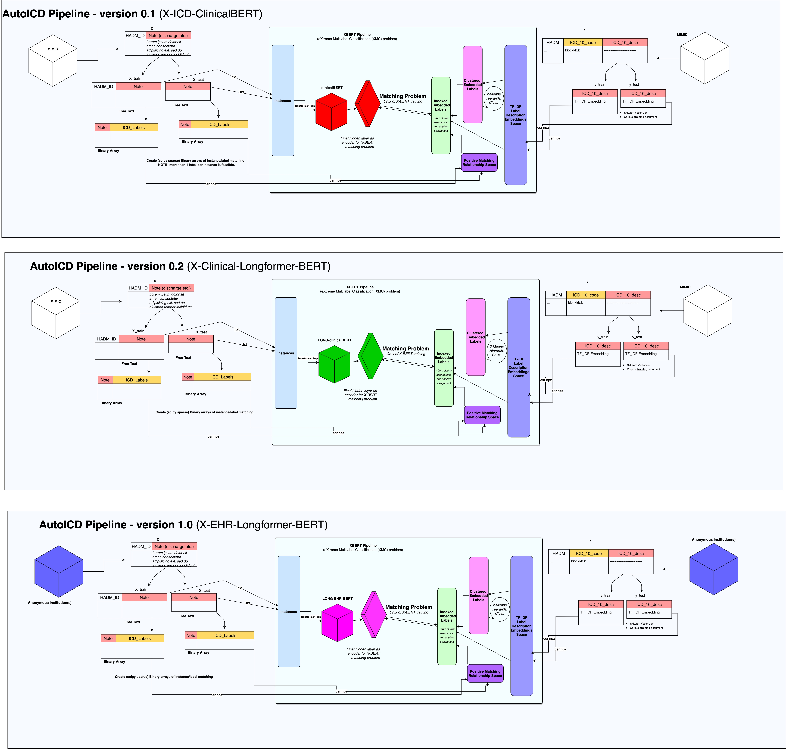

# autoICD startup

<div style="text-align: center; padding: 10px; margin: 10px; border-outline: 1px solid darkgray; border-radius: 3px; background-color: #ff3333; color: white;">
  <strong>WARNING</strong> Never, ever open source this repository!
</div>

<hr/>



To get access to the MIMIC data, please authenticate first:
```bash
export GOOGLE_APPLICATION_CREDENTIALS="$(PWD)/autoicd-gcp-credentials.json"
```

The base dependencies are [conda](https://docs.conda.io/projects/conda/en/latest/user-guide/install/) and [DVC](https://dvc.org).

Run the pipeline using `dvc repro <step>`. To run the front-end app, 

```bash
cd src
python -m virtualenv .venv
./.venv/bin/pip install -r requirements.txt
make app PY="./.venv/bin/python"
``` 

